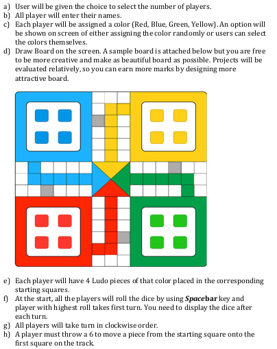
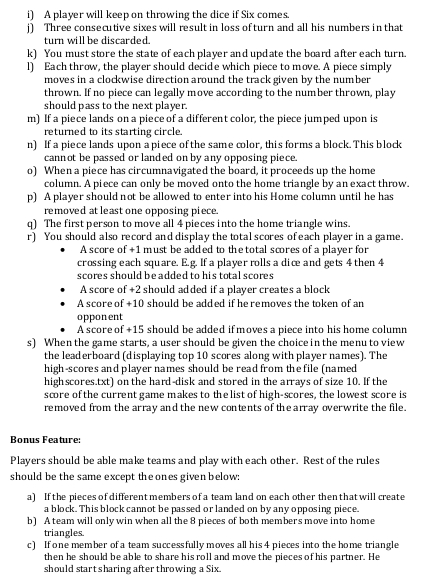

# Desktop_Ludo_Game
Developed in c++ using Glut library. Can be played by 2, 3, or 4 players. Saves High Score after each game. 
## Description

## Tools Used
C++/ GLUT
## How to run
Download all the files except "helpingMaterial" folder. Change the permission of the "game" file by going to properties and allowing it to execute. Open terminal and run the command "./game". If you want to make some changes to the code, you can write the command "make" in the terminal to generate and updated "game" file and then run it accordingly.
